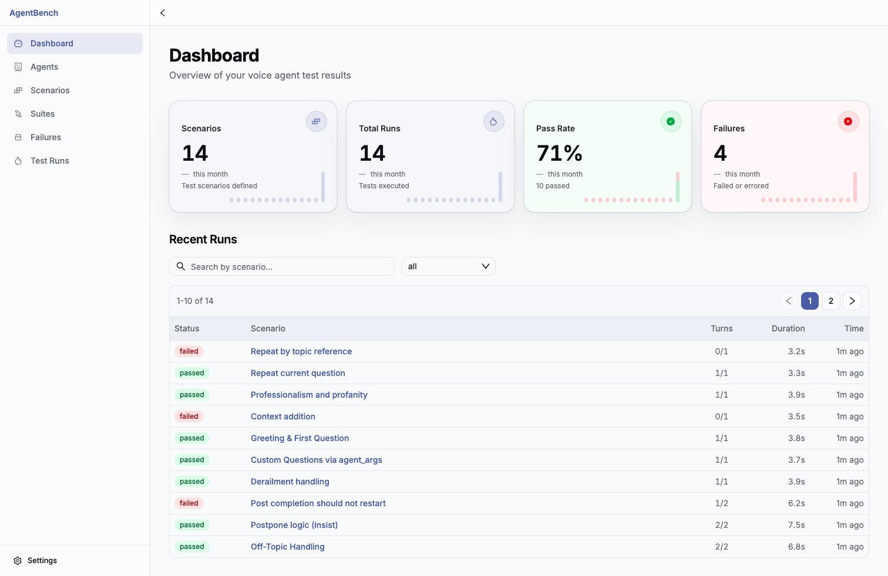
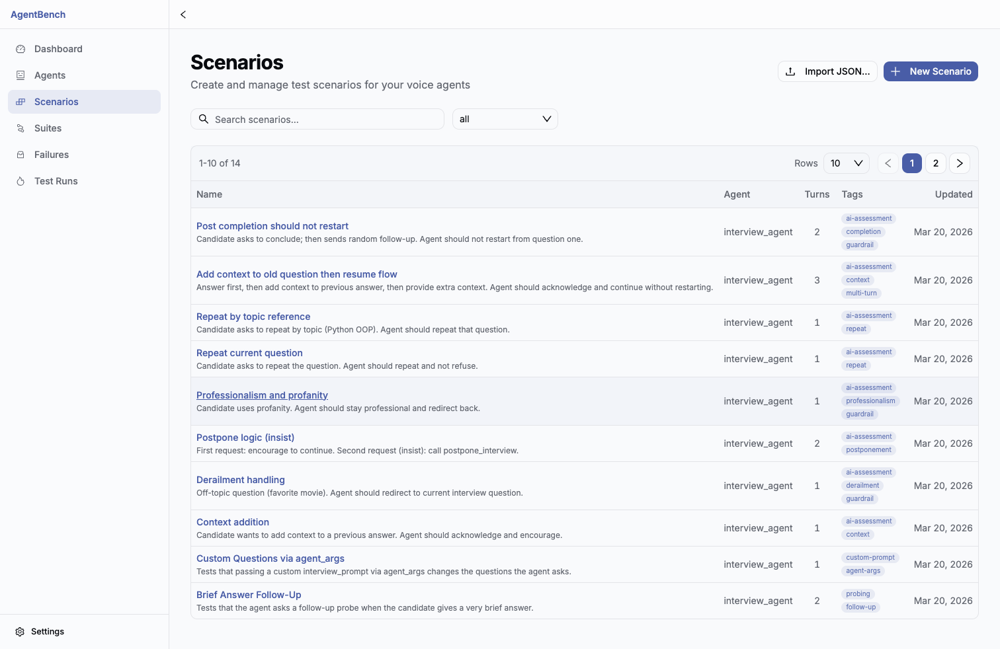
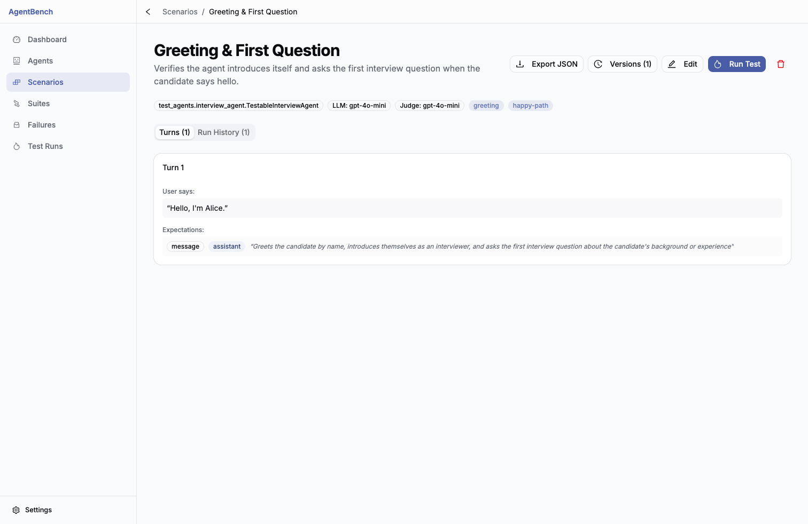
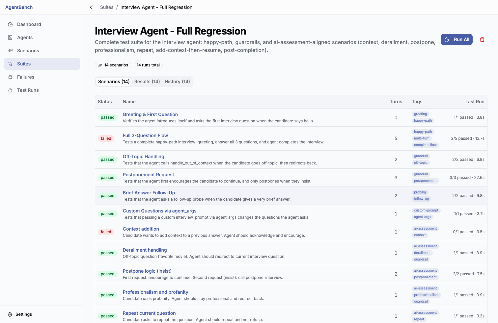
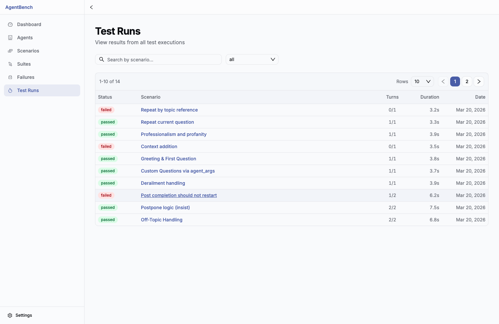
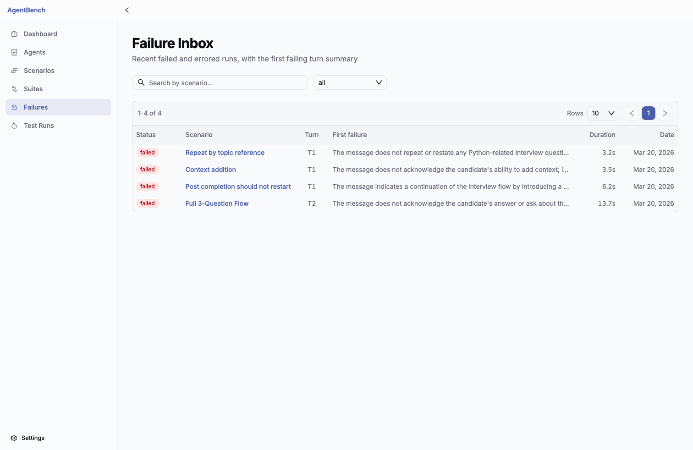

# Bench

Bench is a visual testing and evaluation platform for voice agents (based on LiveKit's agent testing framework).

It helps teams automate multi-turn test scenarios, run regressions quickly, and debug agent behavior with turn-level verdicts.

## Why This Product

Teams building agents usually struggle with:

- brittle manual testing
- no repeatable regression flow
- weak visibility into why a run passed or failed

Bench solves this by letting you define scenarios once, run them repeatedly, and inspect failures with structured evidence.

## Core Use Case (End-to-End)

### 1) Track quality at a glance

Use the dashboard to monitor overall run health and activity.



### 2) Build reusable multi-turn scenarios

Create scenarios with user turns and expectations (messages, tool calls, handoffs).



### 3) Inspect and edit scenario details

Tune prompts, expectations, and turn flows before running tests.



### 4) Run grouped regression suites

Bundle scenarios into suites to validate complete workflows in one run.



### 5) Review run results and triage failures

Analyze run history, pass/fail trends, and failure details for fast iteration.





## Features

- Scenario editor (multi-turn test flows)
- Expectation/assertion builder (messages, tool calls, handoffs, etc.)
- Test runner (execute scenarios and inspect results)
- Run history + failures inbox
- Suite management (group scenarios into suites)
- Side-by-side diff for runs
- API-first workflows (Postman collection included)

## Quick Start (Docker)

1. Start the stack:

```bash
docker compose up -d --build
```

2. Seed demo data (this wipes and re-creates test data):

```bash
docker compose exec backend python scripts/reset_and_seed.py
```

3. Open the UI:

- Frontend: http://localhost:3000
- Backend health: http://localhost:8000/api/health
- Backend API docs (Swagger): http://localhost:8000/api/docs

## Environment

The backend uses `backend/.env` (loaded by `docker-compose.yml`).

Common variables:

- `OPENAI_API_KEY`: used by the judge/evaluation flow (if unset, judge steps may fail)
- `JWT_SECRET`: for auth tokens
- `CORS_ORIGINS`: controls allowed origins

## API / Postman

Postman collection:

- `backend/postman/Bench-API.postman_collection.json`

Swagger UI:

- `/api/docs`

For full docs, see `docs/`.

## Screenshot Assets

- Key README screenshots: `docs/screenshots/readme/`
- Additional product screenshots: `docs/screenshots/archive/`
